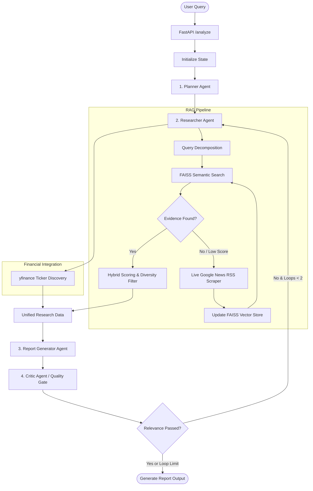

# Agentic AI Framework for Smart Business Decision-Making

An advanced, multi-agent AI framework for automated business intelligence, competitive landscape mapping, real-time financial analysis, and strategic SWOT generation. The system orchestrates multiple specialized agents using **LangGraph** and utilizes a **dynamic Hybrid-Search RAG pipeline** backed by **FAISS** and **Groq (Llama-3.3-70B)**.

---

## 🏗️ Architecture Overview

The system is built on a modular architecture divided into two primary layers: **Agentic Orchestration** (via LangGraph) and the **Dynamic RAG & Scrape Pipeline**.

### System Workflow


### 🤖 Multi-Agent Orchestration Nodes
1. **Planner Agent**: Classifies the incoming query, determines the scope (financial deep-dive vs. strategic SWOT), and generates the initial investigation plan.
2. **Researcher Agent**: Coordinates real-time data collection. It fetches public stock market metrics via a custom `yfinance` discovery tool and queries the local knowledge base. If stale context is detected, it triggers a live web scrape.
3. **Report Generator Agent**: Dynamically adopts a persona depending on query intent:
   - *Senior Equity Research Analyst*: Produces markdown data tables comparing financial metrics (Market Cap, Revenue, P/E, Debt-to-Equity).
   - *Strategic Business Consultant*: Generates a structured SWOT analysis focusing on market opportunities and structural threats.
4. **Critic Agent (Quality Gate)**: Inspects the generated report for hallucinations, verifies that all requested companies are mentioned, ensures required markdown tables exist, and rejects generic fallback data (e.g., defaulting to Wipro when Apple was requested). If criteria are not met, it increments the revision count and sends the state back for refinement.

---

## 🔍 Hybrid RAG & Scraper Design

The retrieval engine features a custom-built Hybrid-Search algorithm that ranks document chunks using a weighted scoring formula:

$$\text{Relevance Score} = 0.50 \times \text{Semantic L2 Similarity} + 0.25 \times \text{Lexical Token Overlap} + 0.15 \times \text{Source Credibility} + 0.10 \times \text{Document Recency}$$

### Highlights
- **Stale Context Prevention**: Before querying, the researcher checks if local data contains keywords from the query. If not, the old cache is cleared, and a fresh scrape is initiated.
- **Dynamic Scraper**: Utilizes Google News RSS feed to retrieve the top 8-16 relevant news links, scrapes paragraph text, strips boilerplate elements, and indexes the split chunks in FAISS on-the-fly.
- **Diversity Filter**: Restricts retrieval to a maximum of 2 chunks per unique source domain to ensure a balanced perspective and prevent single-source bias.

---

## 📊 Experimental Evaluation & Results

The system has been rigorously evaluated across five key experiments to benchmark accuracy, robustness, and strategic quality.

### 1. Competitor Identification Accuracy (Experiment 3)
Evaluates the system's precision, recall, and F1-score in identifying key market rivals against a gold standard dataset (BYD, Tesla, NVIDIA, Apple, Rivian):

| Target Company / Product | Precision | Recall | F1-Score | TP | FP | FN |
| :--- | :---: | :---: | :---: | :---: | :---: | :---: |
| **Tesla** | 0.80 | 0.57 | 0.67 | 4 | 1 | 3 |
| **Apple Smart Glasses** | 0.75 | 0.50 | 0.60 | 3 | 1 | 3 |
| **NVIDIA** | 1.00 | 0.67 | 0.80 | 4 | 0 | 2 |
| **Average Performance** | **0.85** | **0.58** | **0.69** | - | - | - |

### 2. Ablation Study: Query Decomposition (Experiment 1)
Benchmarks system performance with and without RAG sub-query decomposition:

| Configuration | Contexts Found | Answer Completeness |
| :--- | :---: | :--- |
| **Full System (with Decomposition)** | 2 | **Complete** (Found Tesla's Capex and BYD's Revenue) |
| **Ablated System (Raw Query Only)** | 1 | **Incomplete** (Failed to locate BYD revenue details) |

### 3. Noise Robustness (Experiment 5)
Measures the system's performance when processing clean vs. noisy contexts (distractors introduced in the prompt):

| Metric | Clean Context | Noisy Context | Accuracy Preserved? |
| :--- | :---: | :---: | :---: |
| **Latency (Seconds)** | 1.496s | 0.167s | Yes |
| **Token Usage** | 73 | 92 | Yes |

### 4. Qualitative SWOT Quality (Experiment 4)
Assesses generated reports on Strategic Depth, Actionability, and Grounding (scored 1 to 5):

| Target Company | Depth (1-5) | Actionability (1-5) | Grounding (1-5) | Strategic Insights |
| :--- | :---: | :---: | :---: | :--- |
| **BYD** | 2 | 3 | 4 | Standard market expansion, strong grounding. |
| **NVIDIA** | 4 | 3 | 5 | Identified shift to real-time inference & Groq LPU latency threat. |

---

## ⚙️ Setup and Installation

### 1. Clone the Repository
```bash
git clone https://github.com/DhruvTalwarr/Agentic-AI-Framework-for-Smart-Business-Decision-Making.git
cd Agentic-AI-Framework-for-Smart-Business-Decision-Making
```

### 2. Install Dependencies
```bash
pip install -r requirements.txt
```
*(Dependencies include: `fastapi`, `uvicorn`, `langgraph`, `langchain-groq`, `yfinance`, `faiss-cpu`, `sentence-transformers`, `beautifulsoup4`, `feedparser`, `pandas`, `ragas`)*

### 3. Set Up Environment Variables
Create a `.env` file in the root directory:
```env
GROQ_API_KEY=your_groq_api_key_here
```

### 4. Run the fastapi Backend
```bash
uvicorn main:app --reload
```
Exposes the POST endpoint `http://127.0.0.1:8000/analyze`.

---

## 🧪 Running Evaluations
You can run the evaluation suites locally using:
- **Accuracy Metrics**: `python accuracy_test.py`
- **Ablation Study**: `python ablation_test.py`
- **Robustness Test**: `python robust_system_test.py`
- **SWOT Evaluation**: `python swot_test.py`
- **Full RAG Eval**: `python test1_adv.py`
